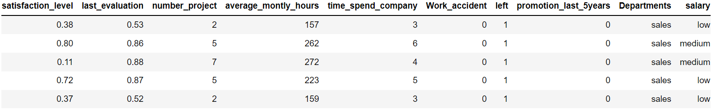
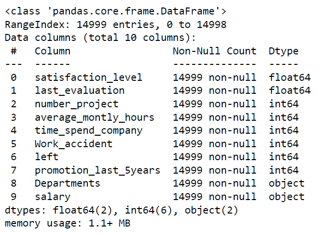
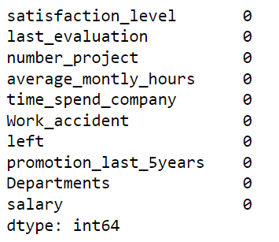
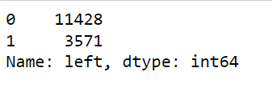
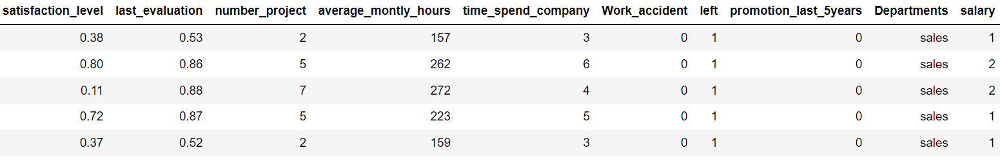
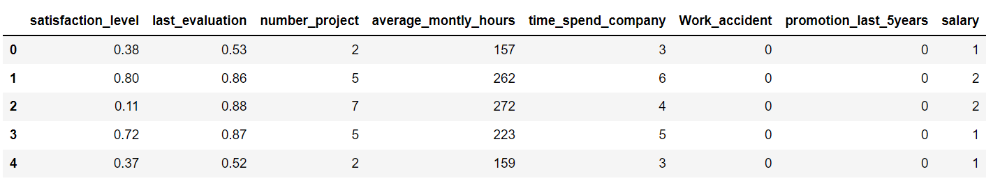
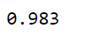
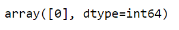

# Implementation-of-Decision-Tree-Classifier-Model-for-Predicting-Employee-Churn

## Aim:
To write a program to implement the Decision Tree Classifier Model for Predicting Employee Churn.

## Equipments Required:
1. Hardware – PCs
2. Anaconda – Python 3.7 Installation / Moodle-Code Runner

## Algorithm
1. Import the required libraries.
2. Upload and read the dataset
3. Check for any missing value in the dataset using isnull function.
4. From sklearn.tree import DecisionTreeClassifier and use criteria as entropy
5. Find the accuracy of the model and predict the required values
by importing the required modules from sklearn 

## Program:
```python 
Program to implement the Decision Tree Classifier Model for Predicting Employee Churn.
Developed by: SRIJITH R
RegisterNumber: 212221240054

import pandas as pd
data=pd.read_csv("Employee.csv")
data.head()
data.info()
data.isnull().sum()
data["left"].value_counts()
from sklearn.preprocessing import LabelEncoder
le=LabelEncoder()
data["salary"]=le.fit_transform(data["salary"])
data.head()
x=data[["satisfaction_level","last_evaluation","number_project","average_montly_hours","time_spend_company","Work_accident","promotion_last_5years","salary"]]
x.head()
y=data["left"]
from sklearn.model_selection import train_test_split
x_train,x_test,y_train,y_test=train_test_split(x,y,test_size=0.2,random_state=100)
from sklearn.tree import DecisionTreeClassifier
dt=DecisionTreeClassifier(criterion="entropy")
from sklearn import metrics
accuracy=metrics.accuracy_score(y_test,y_pred)
accuracy
dt.predict([[0.5,0.8,9,260,6,0,1,2]])

```

## Output:
### Head:

### Data Information:

### Null Dataset:

### Value Counts:

### Head:

### X.Head:

### Accuracy:

### Data Prediction:



## Result:
Thus the program to implement the  Decision Tree Classifier Model for Predicting Employee Churn is written and verified using python programming.
